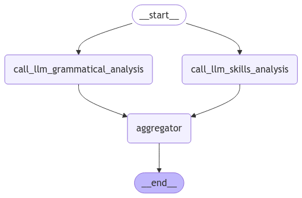
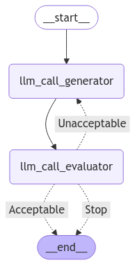

# Resume Analyzer
This is a RAG-based resume analysis tool built using Streamlit for frontend and LangChain for backend. 
It includes two main tasks: analysis of a resume based on a job description, and 
implementation of a conversational retrieval chain to chat with the resume and job description.

The analysis task checks for grammatical issues, compares and evaluates the skills present in the resume 
with the job description, and provides suggestions to the applicant. 
This analysis is parallelized using a LangGraph workflow, where the grammatical check is separated 
from the rest: 



The chat functionality is a LLM augmented with retrieval capabilities on the resume and 
memory containing the job description. It uses a Evaluator-Optimizer workflow to retrieve more 
text documents from the resume: 



## Installation and running
Install two Linux packages, then use pip:
```
apt-get install poppler-utils tesseract-ocr
pip install -r requirements.txt
```
Create and set up a `.env` file from a template:
```
cp .env_mock .env
```

Run with python or streamlit:
```
python main.py
streamlit run app.py
```

### Evaluating the analysis task
Set up the `LANGSMITH_*` variables in the `.env` file as demonstrated in `.env_mock`, then run:
```bash
python evaluation.py 
```